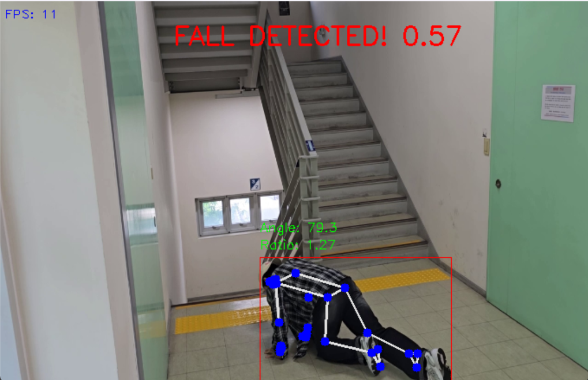

# Real-Time Fall Detection System

## 📌 Project Overview

This project aims to develop a **real-time AI-powered fall detection system** using YOLO and MediaPipe. It detects human falls via a camera and sends immediate alerts through Telegram. The system is designed for use in various environments such as hospitals, nursing homes, and private residences to prevent accidents and enable quick response.

### 🔑 Main Features:
- **Human Detection**: Uses YOLO to accurately detect people in images or video streams.
- **Pose Estimation**: Uses MediaPipe to estimate key body landmarks and posture.
- **Fall Detection**: Detects falls based on body aspect ratio and body tilt angle.
- **Real-Time Alerts**: Automatically sends fall alerts via Telegram with captured images.

---

## ⚙️ System Architecture

The system consists of the following components:

1. **YOLOv8**: Detects humans with high confidence (threshold ≥ 0.7).
2. **MediaPipe**: Extracts 33 body landmarks for detailed posture analysis.
3. **Fall Detection Algorithm**: Uses aspect ratio, body angle, and a sliding window to calculate a confidence score.
4. **Telegram Alert System**: Sends alerts with JPEG images when a fall is detected.
5. **Streamlit UI**: Provides real-time video display with fall status visualization.

---

## 🛠️ Installation & Usage

### 🔧 Requirements
- Python 3.8+
- All required libraries are listed in `requirements.txt`.

### 📥 Installation

1. Clone the repository:
   ```bash
   git clone <repository_url>
   cd <repository_directory>
   ```

2. Install dependencies:
   ```bash
   pip install -r requirements.txt
   ```

3. Configure Telegram bot credentials in `telegram_alert.py`:
   ```python
   BOT_TOKEN = 'your_bot_token'
   CHAT_ID = 'your_chat_id'
   ```

### ▶️ Execution

1. **Run with OpenCV (CLI)**:
   ```bash
   python main.py
   ```

2. **Run with Streamlit (Web UI)**:
   ```bash
   streamlit run app.py
   ```
3. **Quick Launch (Windows)**
  If you are using Windows, you can quickly launch the application by simply double-clicking the file:
   ```bash
   run_app.bat
   ```
   📌 This batch file will automatically execute streamlit run app.py to start the web-based fall detection interface.
---

## 📂 Key Code Files

- `main.py` – Main script for real-time detection using YOLO and MediaPipe.
- `fall_detector.py` – Includes pose estimation and fall detection logic.
- `telegram_alert.py` – Sends alerts via Telegram Bot API.
- `app.py` – Web-based UI built with Streamlit.

---

## 📷 Visual Examples

### Image Output
  
*Explanation*: In the Streamlit UI, a red bounding box indicates a detected fall, while green indicates normal posture.

---

## 📚 References

1. [Salimi, M. et al., *Using Deep Neural Networks for Human Fall Detection Based on Pose Estimation*, Sensors, 2022.](https://www.mdpi.com/1424-8220/22/12/4544#fig_body_display_sensors-22-04544-f001)
2. [YOLO Documentation - Ultralytics](https://docs.ultralytics.com)
3. [Google MediaPipe Documentation](https://ai.google.dev/edge/mediapipe/solutions)
4. [Yong Chen et al., *Vision-Based Fall Event Detection Using Attention Guided Bi-Directional LSTM*](https://www.researchgate.net/publication/346894576_Vision-Based_Fall_Event_Detection_in_Complex_Background_Using_Attention_Guided_Bi-Directional_LSTM)
5. [Telegram Bot API](https://core.telegram.org/bots/api)
6. [OpenCV + MediaPipe Fall Detection](https://github.com/onenationonemind1/falling_detection)
7. [YOLO-NAS Custom Object Detection – Code with Aarohi](https://youtu.be/pgf9bPuEsFo?si=MR7y7VPIFWNPCVbZ)
8. [Ali Zara et al., *Human Fall Detection Using Pose Estimation with Transformers*](https://www.sciencedirect.com/science/article/pii/S0952197624019687)

---

## 📄 License

This project is licensed under the **MIT License**.  
See the `LICENSE` file for details.
